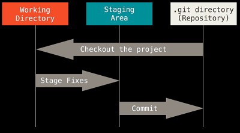
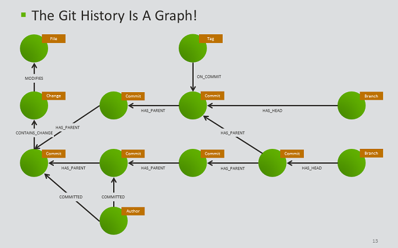

```{r setup, include=FALSE}
knitr::opts_chunk$set(echo = FALSE)
```


## Books and Courses

https://git-scm.com/book/en/v2

https://git-scm.com/book/pl/v2

https://www.atlassian.com/git/tutorials

https://www.atlassian.com/git/tutorials/atlassian-git-cheatsheet

https://www.coursera.org/learn/version-control-with-git

## DevOps - Agile 

DevOps, it basically means modern software development practices. 
DevOps has a few fundamental principles that most modern software projects follow. 
One of the key principles is to continuously plan, build and release small improvements to your product. 

Agile software development describes an approach to software development under which requirements and solutions evolve through the collaborative effort of self-organizing and cross-functional teams

## DVC

A distributed version control system is a type of version control system.  
It usually has characteristics: 

- Each user has a local copy of the complete history of the project - repository. 
- Even though repositories are distributed among team members there's also a single remote repository that is designated as the source of truth or official state of the project.   hosted in a data center or in the cloud. 
- can  work while offline.  
- content is synchronized between repositories by pulling content from or pushing content to a remote repository. 

Git is a distributed version control system.

## Locations

- Working tree  
- Staging area/index  
- local repository  
- remote repository



## Remote Repository

[miceFast - Github](https://github.com/Polkas/miceFast)

[matchSC - BitBucket](https://stash.allegrogroup.com/projects/SUPPLYCHAIN/repos/matchsc/browse)

In theory we could do most of the things using only BitBucket or Github

## Remote Repository - Github/Bitbucket

- Edit a file and commit  
- upload a file or files and commit  
- fork a repository - buckup a project or prepare for pull request  (fork have to be updated manually)
- pull request as comments to same part of project

calm down if your pull request is meaningless - receiver should see that

## Git Graph Model




## Bash

```
echo
ls -l -a
mkdir
cd .. cd / cd ~ cd directory
cp
mv
rm -r # directory
rm
|/>/<
touch
nano/vim
head
tail
cat
tac
less
man wc
wc file.txt
grep
```

## CM Practice Intro

```
clone
touch file
nano file
git status
git add file
git commit -m ""
git remote -v
git push origin master
```

```
git log
```

## Git Objects

“plumbing” commands vs. “porcelain” commands (user-friendly)

key-value data store

key - SHA-1 (GIT ID)

```echo ""Hello World"" | git hash-object --stdin```
```echo ""Hello Worldd"" | git hash-object --stdin```

Commit - snapshot
Blob - content of file
Tree - relations of folders/files with their names
Annotated Tags

```
git cat-file commit HEAD
(printf "commit %s\0" $(git cat-file commit HEAD | wc -c); git cat-file commit HEAD) | sha1sum
```

## Git References

HEAD file is a symbolic reference to the branch you’re currently on. 
It doesn’t generally contain a SHA-1 value but rather a pointer to another reference.


```
HEAD~~ or HEAD~5 or HEAD~^2
git show HEAD
```

Branch label is a reference that points to the tip of the branch
HEAD is a reference that points to the current commit

```
git checkout master
```

tags

```
git tag
git tag -a v1.4 -m "my version 1.4"
git show v1.4
git tag -a v1.2 9fceb02
git push origin v1.5
git push origin --tags
```

## Branches

A branch is a set of commits that trace back to the project's first commit. 
Creating a branch creates a branch label. Checkout involves updating the head reference and updating the working tree. 
A detached head reference points directly to a commit. 
Fix a detached head by creating a branch. Deleting a branch deletes a branch label.

```
git branch MN
git checkout 
```

## Merging

A **fast-forward** merge moves the base branch label to the tip of the topic branch.  
A merge is fast-forwardable if no other commits have been made to the base branch since the branch was created. 

A **merge commit** is the result of combining the work of multiple commits. 
A merge commit has multiple parents.

```
git checkout master
git merge MN
```

## Resolving Merge Conflicts

When:

For example on feature branch and master branch is different changes at same file at the local or remote area.

```
git checkout master
git merge MN
nano conflict_file
git add conflict_file
git commit
```

## Tracking Branches

a local branch that represent a remote branch

```
git branch
git branch --all
git log origin/master --oneline
```

## Fetch, Pull and Push

```
git fetch + git merge = git pull
git fetch + git reset --hard origin/master # lost our work
```

My changes to the top

```
git pull --rebase
git push
```

For example after local rebase:

```
git push --force
```

To check the state

```
git log orign/master --oneline --graph --all
git fetch
git log orign/master --oneline --graph --all
git log --oneline --reflog
```

## Rebasing

Do not rewrite history that has been shared with others.

regular vs interactive

```
git checkout MN
git rebase master

nano conflict_file
git add conflict_file

git rebase --continue # to continue
git rebase --abort #to stop
```

```
git rebase -i HEAD~3
```

## Return to some older work

[**revert vs reset vs checkout**](https://www.atlassian.com/git/tutorials/resetting-checking-out-and-reverting)

## Pull Requests 

The ultimate goal of a pull request is to merge a branch, but they also facilitate team discussion and approval. 

You can open a pull request any time after creating the branch, you do not need to edit the pull request if you add a commit to the branch.

You can merge the pull request using an online Git host or by pushing the merge
from your local client.

Forks

## GIT WORK FLOWS

Git is very flexible and can be tailored to many types of projects and teams. 

You can mix and match some of the workflow ideas described in this video. 

We will start by discussing centralized workflows. A centralized workflow uses a single
branch to accomplish the work of the project.

A down side of the centralized workflow is that you are not taking advantage of features related to branching,
such as pull requests. Next we will discuss the feature branch workflow. 


